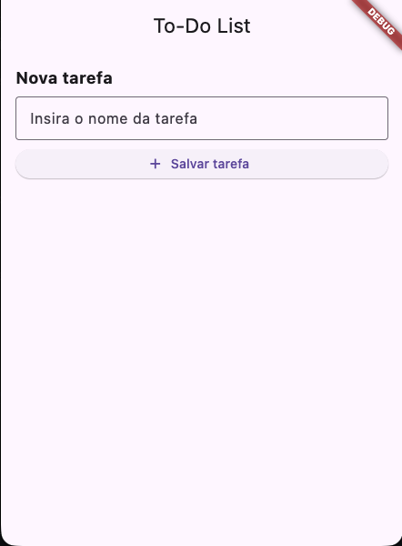
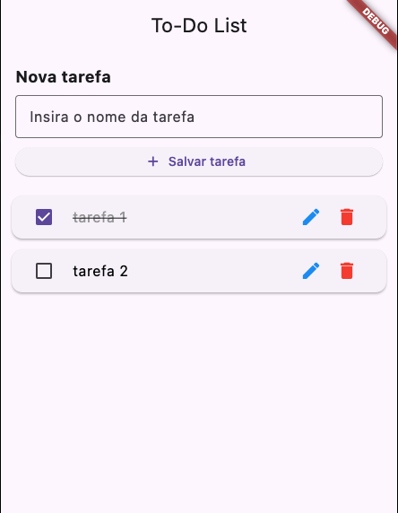
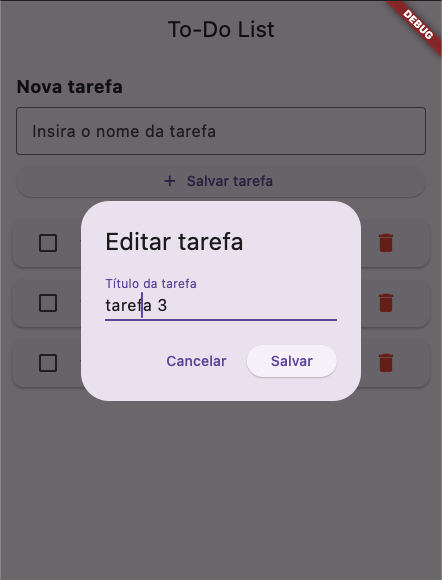

# Trabalho 4: Aplicação de Lista de Tarefas com Gestão de Estado em Flutter

## Descrição da Aplicação

Este projeto consiste em uma **aplicação de lista de tarefas (To-Do List)** desenvolvida em **Flutter**, com o objetivo de aplicar conceitos práticos de gestão de estado. A aplicação permite que o usuário gerencie suas atividades diárias de forma simples e intuitiva. As funcionalidades implementadas incluem a adição de novas tarefas através de um campo de texto, a visualização de todas as tarefas cadastradas em uma lista rolável, a possibilidade de marcar tarefas como concluídas (com feedback visual imediato) e a remoção de tarefas indesejadas. Além disso, o projeto inclui uma funcionalidade extra de edição do título das tarefas já criadas.

## Gestão de Estado com Riverpod

A gestão de estado da aplicação foi implementada utilizando o pacote **`flutter_riverpod`**, uma solução moderna e robusta para o ecossistema Flutter. A escolha do Riverpod garante que a interface do usuário seja atualizada de forma reativa e eficiente sempre que houver mudanças nos dados das tarefas.

### Detalhes da Implementação:

- **`TaskNotifier` (StateNotifier)**: A lógica central de estado reside na classe `TaskNotifier`, que estende `StateNotifier<List<Task>>`. Esta classe gerencia uma lista imutável de objetos `Task`. Ela expõe métodos específicos para manipular essa lista, como `addTask` (adicionar), `toggleTask` (alternar status de conclusão), `removeTask` (excluir) e `editTask` (editar título).
- **`taskProvider`**: Um `StateNotifierProvider` foi criado para instanciar e expor o `TaskNotifier` para o restante da aplicação.
- **Reatividade na Interface**: A tela principal (`HomeScreen`) estende `ConsumerWidget`, permitindo que ela "escute" as mudanças de estado. Utilizando `ref.watch(taskProvider)`, a interface reconstrói automaticamente apenas as partes necessárias (como o `ListView.builder`) sempre que a lista de tarefas é modificada, garantindo alta performance.
- **Imutabilidade**: O estado é atualizado criando novas instâncias da lista e dos objetos `Task` (utilizando o método `copyWith`), seguindo as melhores práticas de programação funcional e evitando efeitos colaterais indesejados.

## Estrutura do Projeto

O código fonte está organizado de forma modular dentro do diretório `lib`, separando claramente as responsabilidades:

- **`models/task.dart`**: Contém a classe de modelo `Task`, que define a estrutura de dados de uma tarefa (título e status de conclusão).
- **`providers/task_provider.dart`**: Centraliza a lógica de gestão de estado com o Riverpod (`TaskNotifier` e `taskProvider`).
- **`screens/home_screen.dart`**: Contém a interface principal do usuário, implementando o layout com `Scaffold`, `TextField` para entrada de dados e `ListView.builder` para renderização eficiente da lista de tarefas.
- **`main.dart`**: Ponto de entrada da aplicação, que envolve o app principal com o `ProviderScope` necessário para o funcionamento do Riverpod.

## Instruções para Execução

Para executar este projeto em seu ambiente de desenvolvimento local, siga os passos abaixo:

### Pré-requisitos

Certifique-se de ter o **Flutter SDK** instalado e configurado corretamente em sua máquina. Você pode verificar o status da instalação executando:

```bash
flutter doctor
```

### Passos para Execução

1. **Clone o repositório** para o seu computador:

   ```bash
   git clone https://github.com/EdiJunior2005/dispositivos-mobile
   ```

2. **Acesse o diretório do projeto**:

   ```bash
   cd dart_app
   ```

3. **Instale as dependências** necessárias (incluindo o `flutter_riverpod`):

   ```bash
   flutter pub get
   ```

4. **Execute a aplicação** em um emulador, dispositivo físico conectado ou navegador web:

   ```bash
   flutter run
   ```

## Prints ou GIFs Demonstrando o Funcionamento







